# Week 1 — App Containerization

## Set up backend-flask 
-   set up venv - added `venv` to `.gitignore`
-   running locally required loading the requirements.txt dependencies, not just flask:
    ` pip3 install -r requirements.txt`
    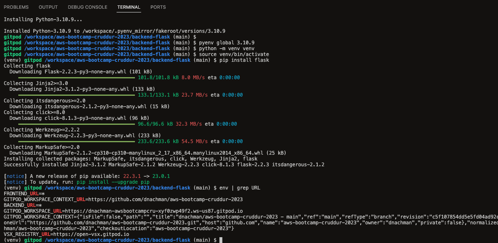
-   Ran backend on gitpod, modified home_activities.py:
    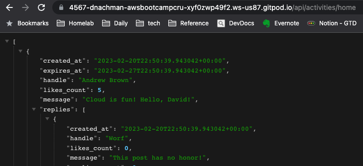
-   Created `Dockerfile`
-   Build the image
    `docker build -t backend-flask:latest .`
    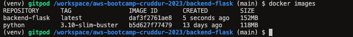
- Run locally: `docker run --rm -p 4567:4567 -d -e FRONTEND_URL -e BACKEND_URL backend-flask:latest`
## Set up frontend-react-js
-   `npm install`
-   `cp .env.example .env` (this was a **gotcha** for me the first time)
-   Created `Dockerfile`
-   Added `.dockerignore` to exclude node_modules because I have a layer in the dockerfile that runs `npm install`
- Run locally, passing in backend url: `docker run -p 3000:3000 -e REACT_APP_BACKEND_URL="https://4567-${GITPOD_WORKSPACE_ID}.${GITPOD_WORKSPACE_CLUSTER_HOST}" -d frontend-react-js`
## Create the docker-compose.yml and run the application
- running inside gitpod:
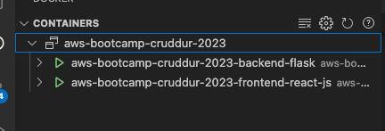
- This error on my part had me hunting down CORS errors for about an hour:
    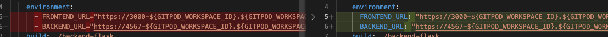

## Add DynamoDB local 
- Add to compose file
- Set up our table: 
    ```
    aws dynamodb create-table \
        --endpoint-url http://localhost:8000 \
        --table-name Music \
        --attribute-definitions AttributeName=Artist,AttributeType=S AttributeName=Album,AttributeType=S \
        --key-schema AttributeName=Artist,KeyType=HASH AttributeName=Album,KeyType=RANGE \
        --provisioned-throughput ReadCapacityUnits=1,WriteCapacityUnits=1 \
        --table-class STANDARD
    ```
- Check table `aws dynamodb list-tables --endpoint-url http://localhost:8000`
    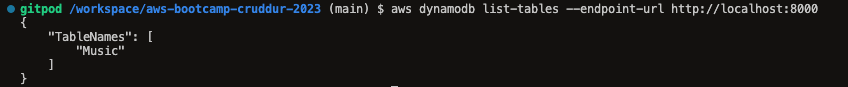
- Add an item:
    ```
    aws dynamodb put-item \
        --endpoint-url http://localhost:8000 \
        --table-name Music \
        --item '{"Artist": {"S": "Pink Floyd"}, "Album": {"S": "Dark Side of the Moon"}}' \
        --return-consumed-capacity TOTAL
    ```
    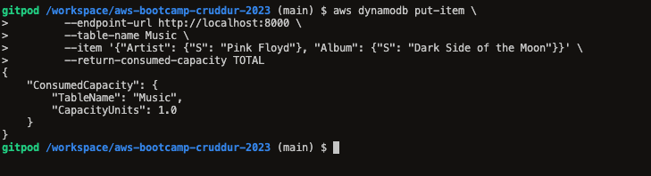
- Scan the table `aws dynamodb scan --table-name Music --endpoint-url http://localhost:8000`
    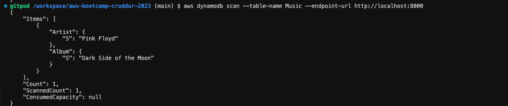

## Postgres 
- Add to compose file
- Connect via plugin:
    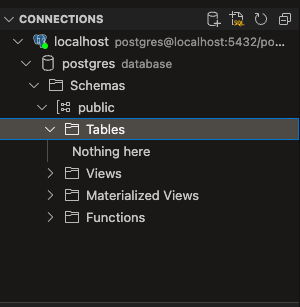
- Connect via command line `psql --host=localhost --user=postgres`
    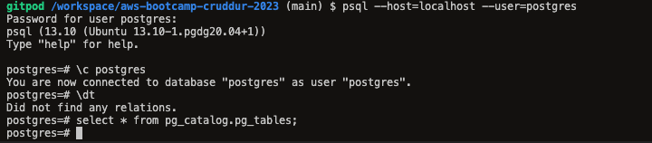
- Run query on default database `select * from pg_catalog.pg_tables;`
    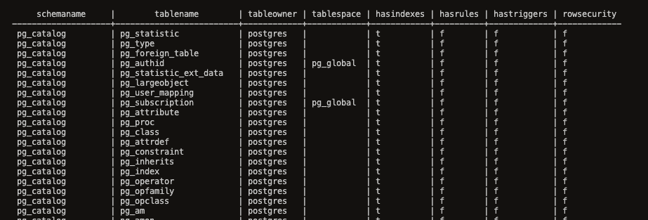
