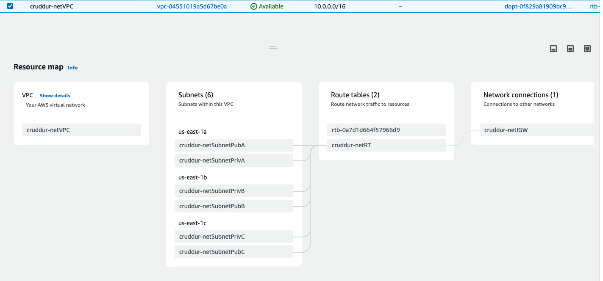
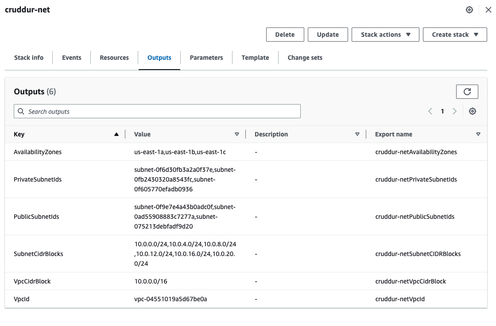
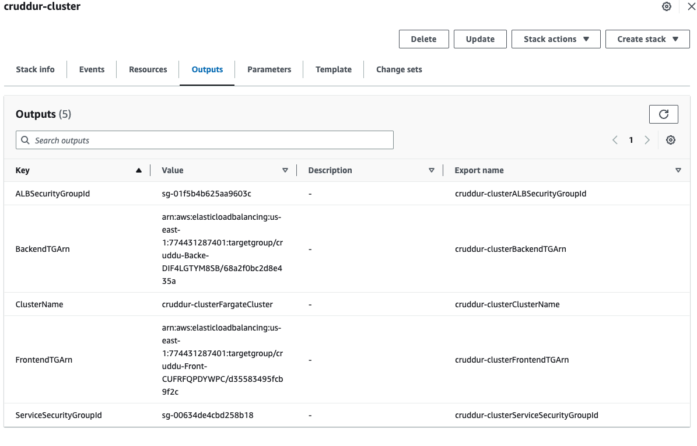
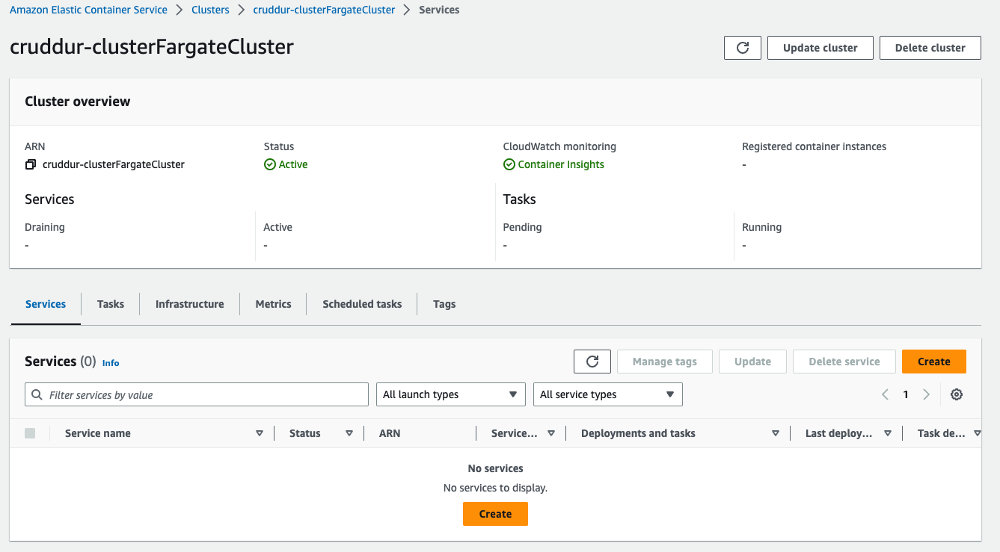
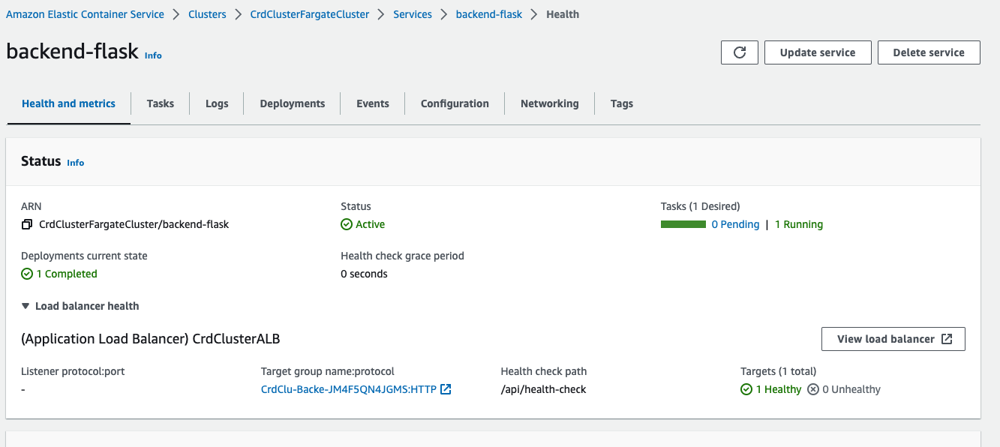

# Week 10 — CloudFormation Part 1

## Preparation

Install `cfn-lint` for python

https://github.com/aws-cloudformation/cloudformation-guard

Set up environment:

```
aws s3 mk s3://cfn-artifacts
export CFN_BUCKET="cfn-artifacts"
gp env CFN_BUCKET="cfn-artifacts"
```

## Networking

CFN Template in `aws/cfn/networking/template.yaml`

Create VPC

Create InternetGateway / Attach

Create RouteTable

Create Route

Create Subnets

Our VPC after creation:


Outputs from cloudformation:


## Cluster

CFN Template in `aws/cfn/cluster/template.yaml`

Output of cloudformation:


Cluster overview screen:


## Services

CFN template in `aws/cfn/service/template.yaml`

## Postgres DB

CFN Template in `aws/cfn/db/template.yaml`

Healthy backend cluster once done:


## DDB

Use SAM

## CICD
