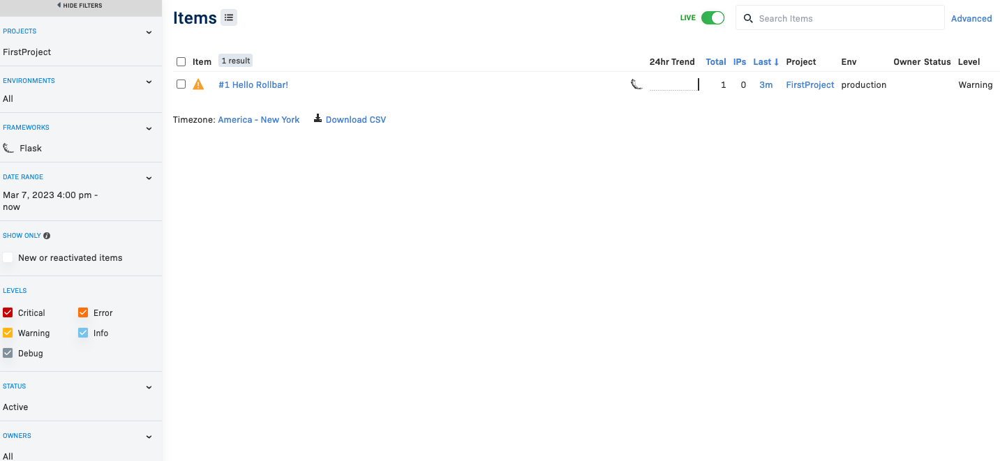

# Week 2 — Distributed Tracing

## Set up honeycomb

-   Installed honeycomb.io / open telemetry and honeycomb started to get data:
    
    
-   Created a manual span for mock-data and get it in trace:
    
-   Created some attributes in the span and ran query for it
    
    

## Amazon XRay

-   Added instrumentation to app.py
-   Set up xray group:

```
aws xray create-group --group-name "Cruddur" --filter-expression "service(\"backend-flask\")"
```

-   Set up sampling rules:

```
aws xray create-sampling-rule --cli-input-json file://aws/json/xray.json
```

-   Added the daemon to docker-compose.
-   Had to make sure app was initialized before xray (before I got to that part in the video ;) )
-   Ran and checked traces:
    
-   Service map:
    
-   Added a segment around user activities
-   Ran and got additional traces - can see the user_activities node
    
-   Able to see segment data and the metadata that was passed in (e.g. hello:david) :
    

## Amazon Cloudwatch

-   Added cloudwatch configuration and a logger to backend-flask
    -   Added to app.py `@app.after_request` to log metrics
    -   Added logs to route for `/api/activities/home`
-   Updated docker-compose with necessary environment variables
-   Ran app and checked log events:
    

## Rollbar
- Added rollbar dependencies and initialization code to the backend app
- Set the `ROLLBAR_ACCESS_TOKEN: "${ROLLBAR_ACCESS_TOKEN}"` in the docker-compose.yml
- Check rollbar for logs from the application:
    
- Caused an intentional error in the application and saw it logged into Rollbar:
    
