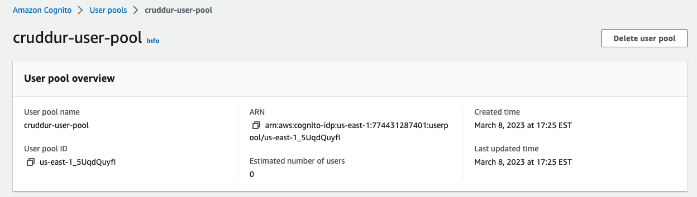

# Week 3 — Decentralized Authentication

## Set up Cognito

- Create user pool `cruddur-user-pool`
  
- added the `aws-amplify` package to frontend
- initialized amplify
- set up docker-compose environment variables
- Changed signin to ask for **username** since email isn't used to sign in.
- Verified Signout works
