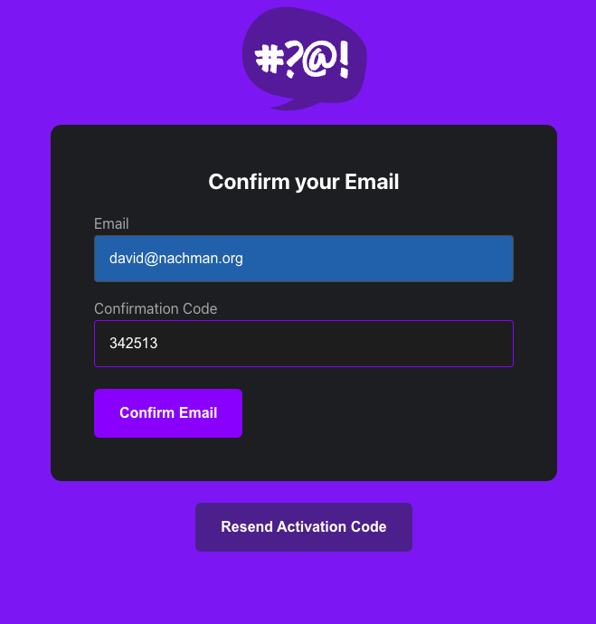
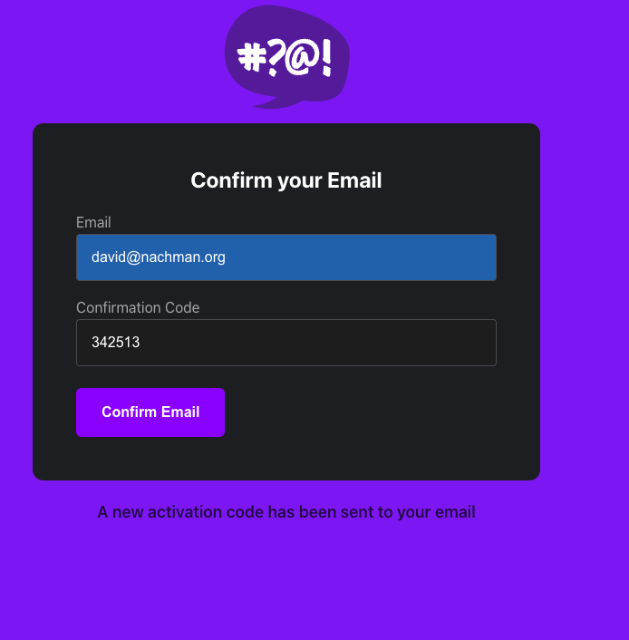
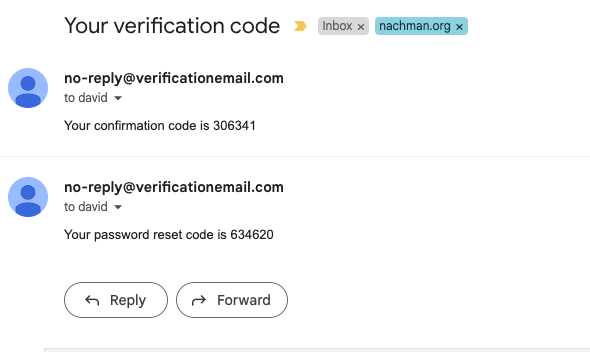
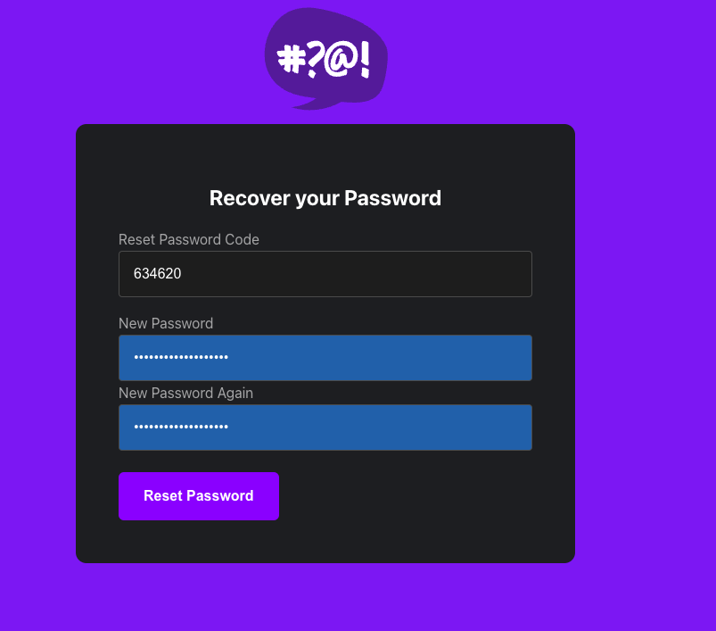
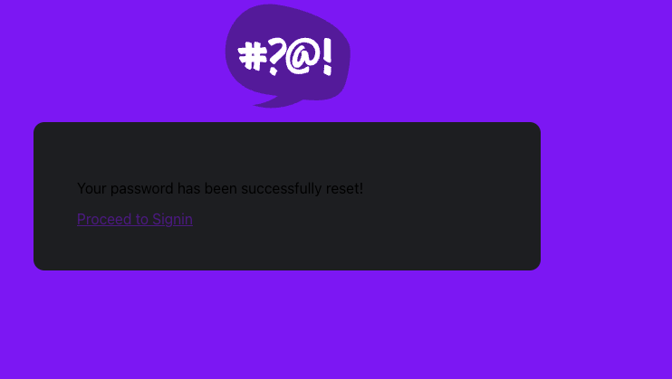
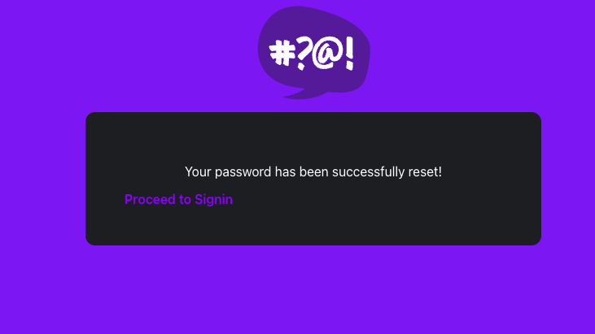
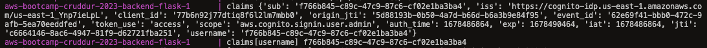
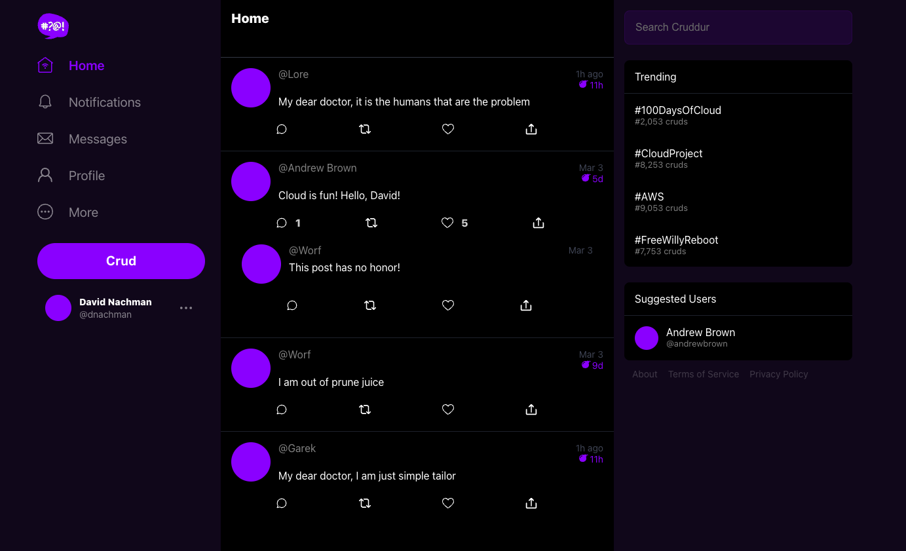
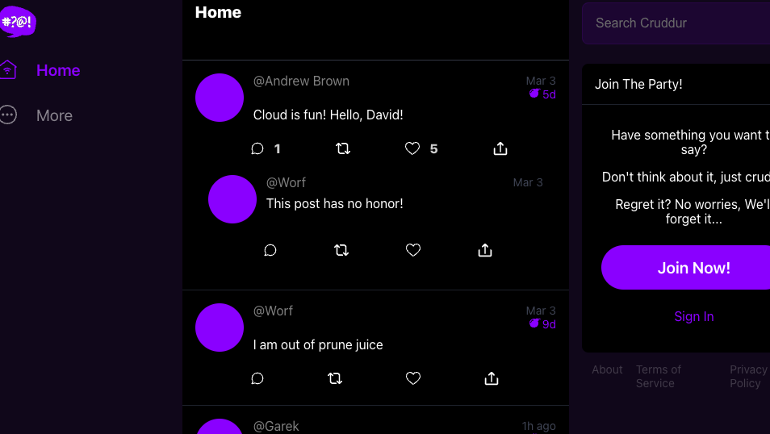

# Week 3 — Decentralized Authentication

## Set up Cognito

- Create user pool `cruddur-user-pool`
  
- added the `aws-amplify` package to frontend
- initialized amplify
- set up docker-compose environment variables
- Verified flows and activation codes, etc:

  - Confirm activation code after signup:
    
  - Resending activation codes:
    
  - Received codes in email:
    
  - Password recovery:
    
  - Recovery confirmation (original):
    
  - **BONUS** Restyled the password recovery confirmation using css:

  ```
  article.recover-article p {
      text-align: center;
      color: #fff;
  }

  article.recover-article a.proceed {
      color: rgba(149,0,255,1);
      text-decoration: none;
      font-weight: 600;
  }
  ```

  

## Backend JWT validation
- Followed the long and winding road to implement JWT backend validation in Flask
- Hit an issue with the verification library not seeing the `jose` library, so added `python-jose` to my `requirements.txt` (this may have been a gitpod workspace issue, will investigate next time i rebuild the workspace)
- Got it working and can see the claims:
  
- Showing the authenticated user the extra post in home from Lore:
  
- Once logged out, the non-authenticated user sees the normal home list:
  