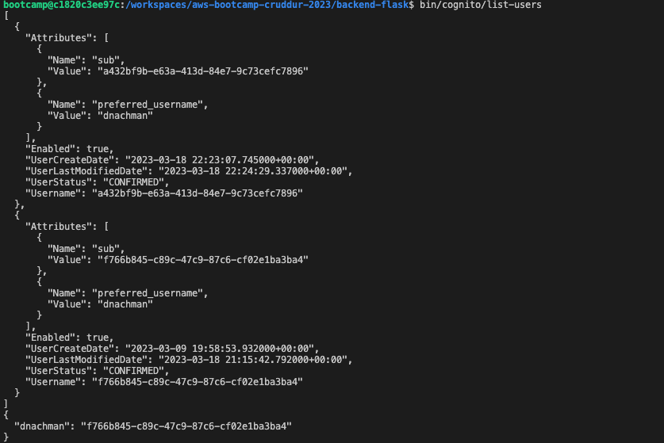
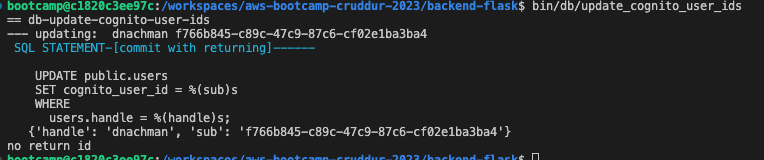
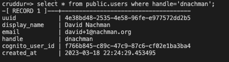

# Week 5 — DynamoDB and Serverless Caching

## DynamoDb

- Reorganized the bin directories
- Added scripts to create ddb, drop etc as prep for deeper work
- Created new script to list users in `bin/cognito/list-users`:
  
- Created script to update cognito users into Postgresql `bin/db/update_cognito_user_ids`

  - Ran it to update the cognito_user_id:
    
  - Confirmed in the rds database:
    

- Implement `CheckAuth.js` in the frontend project

## Other

- Added `bin/rds-start-instance` and `bin/rds-stop-instance` to backend project to help with managing RDS
