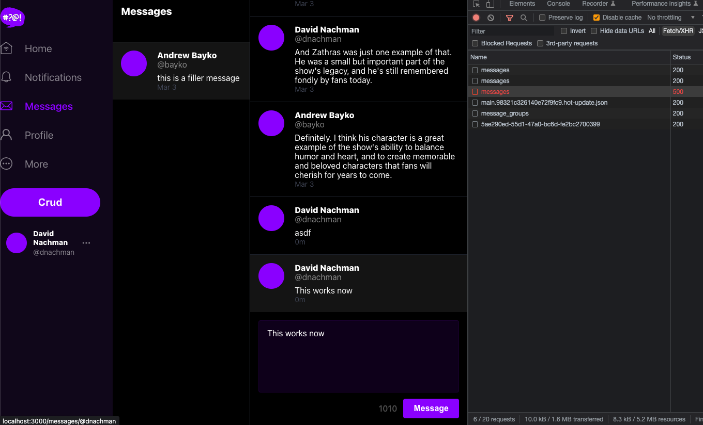
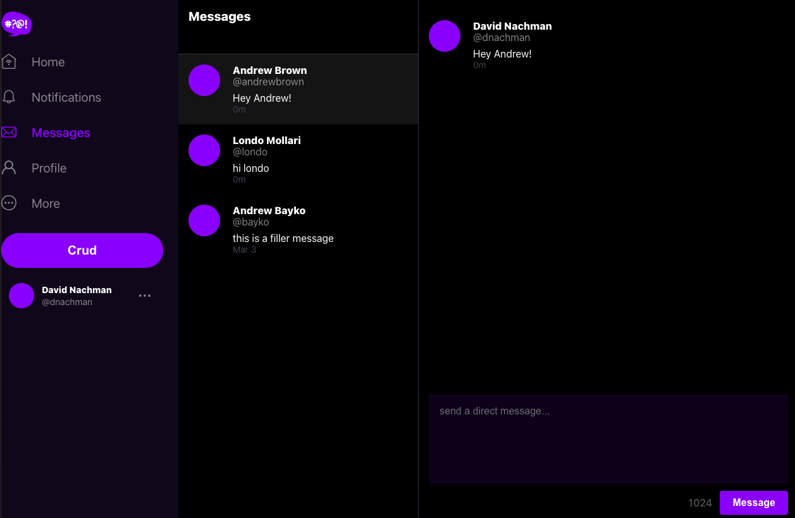
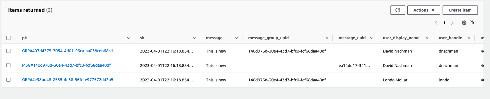

# Week 5 — DynamoDB and Serverless Caching

## DynamoDb

- Reorganized the bin directories
- Added scripts to create ddb, drop etc as prep for deeper work
- Created new script to list users in `bin/cognito/list-users`:
  
- Created script to update cognito users into Postgresql `bin/db/update_cognito_user_ids`

  - Ran it to update the cognito_user_id:
    
  - Confirmed in the rds database:
    

- Implement `CheckAuth.js` in the frontend project
- Modify `bin/ddb/seed` to have my username instead of **andrewbrown** so I could see the results
  
- Rework frontend MessageGroups, etc and the `messages.py`, `message_groups.py`, etc to get the message listing to display correctly bassed on `message_group_uuid`
  
- Complete the `MessageForm.js` compoonent and `message_groups.py` and sql to allow posting of messages to a conversation:
  
- Complete the journey to create new messages with `MessageGroupNewItem.js`, `MessageGroupNewPage.js` and changes in the backend to support it:
  

- This is an image of the DynamoDb modeling and a row representation from the class:
  
  

## Dynamodb Streams

- Update `schema-load` script to add Global Secondary index for `message_group_uuid`
- Create the production table and turn on DDB streams to capture 'new image' attributes
- Create a VPC endpoint for dynamodb
- Create a lambda to handle the DDB stream
  - Connect it to the VPC
  - Create a role that allows update to ddb & attach `AWSLambdaInvocation-DynamoDB` policy
  - Create an inline policy for ddb update scoped to our table:
    ```
      {
        "Version": "2012-10-17",
        "Statement": [
            {
                "Sid": "VisualEditor0",
                "Effect": "Allow",
                "Action": [
                    "dynamodb:PutItem",
                    "dynamodb:DeleteItem",
                    "dynamodb:Scan",
                    "dynamodb:Query"
                ],
                "Resource": [
                    "arn:aws:dynamodb:us-east-1:XXXX:table/cruddur-messages/index/message-group-sk-index",
                    "arn:aws:dynamodb:us-east-1:XXXX:table/cruddur-messages"
                ]
            }
        ]
    }
    ```
- Create trigger in ddb to send to the lambda
- Testing it we can see the messages are making it into the ddb and updated:
  
  

## Other

- Added `bin/rds-start-instance` and `bin/rds-stop-instance` to backend project to help with managing RDS
