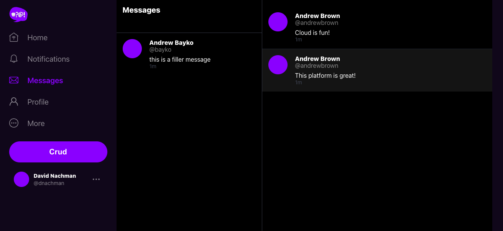
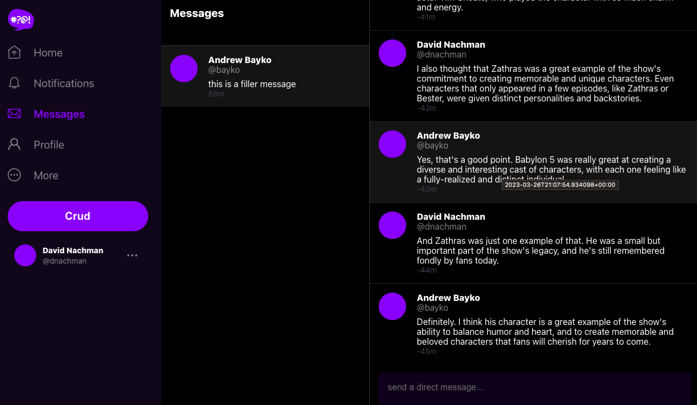
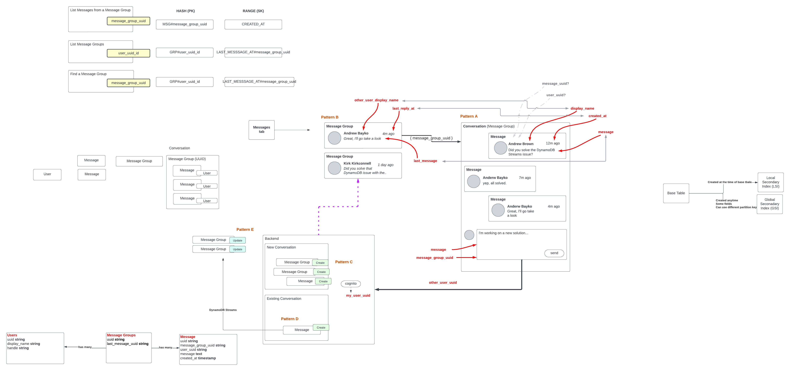
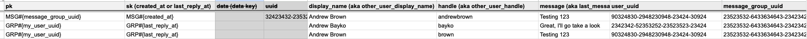

# Week 5 — DynamoDB and Serverless Caching

## DynamoDb

- Reorganized the bin directories
- Added scripts to create ddb, drop etc as prep for deeper work
- Created new script to list users in `bin/cognito/list-users`:
  
- Created script to update cognito users into Postgresql `bin/db/update_cognito_user_ids`

  - Ran it to update the cognito_user_id:
    
  - Confirmed in the rds database:
    

- Implement `CheckAuth.js` in the frontend project
- Modify `bin/ddb/seed` to have my username instead of **andrewbrown** so I could see the results
  
- Rework frontend MessageGroups, etc and the `messages.py`, `message_groups.py`, etc to get the message listing to display correctly bassed on `message_group_uuid`
  

- This is an image of the DynamoDb modeling and a row representation from the class:
  
  

## Other

- Added `bin/rds-start-instance` and `bin/rds-stop-instance` to backend project to help with managing RDS
