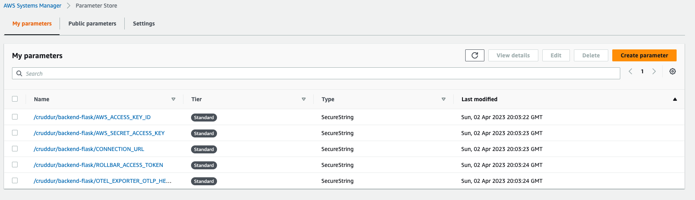
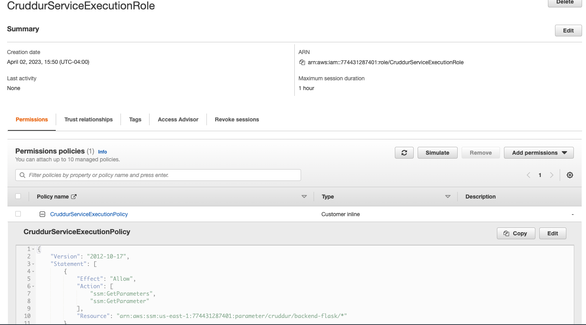
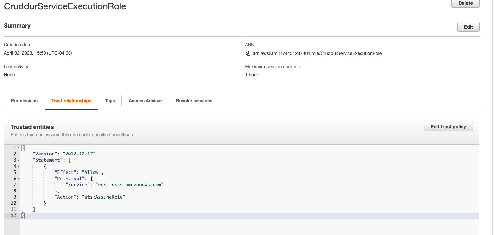
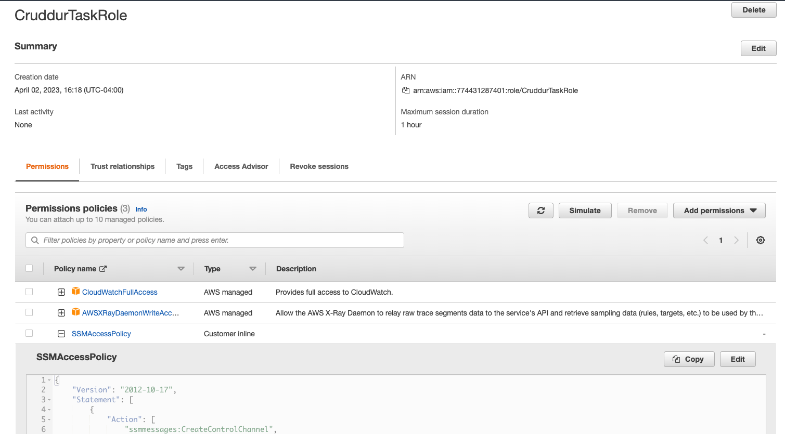

# Week 6 — Deploying Containers

- Created `bin/db/test` to perform healthcheck against rds
- Added healthcheck endpoint to `app.py`
- Added `bin/flask/health-check` to test the health check
- Created Cloudwatch group for cluster:
  ```
  aws logs create-log-group --log-group-name "cruddur"
  aws logs put-retention-policy --log-group-name "cruddur" --retention-in-days 1
  ```
- Create an ecs cluster

  ```
  aws ecs create-cluster \
    --cluster-name cruddur \
    --service-connect-defaults namespace=cruddur
  ```

- Create Elastic Container Registry (ECR):

  ```
  aws ecr create-repository \
  --repository-name cruddur-python \
  --image-tag-mutability MUTABLE
  ```

## Prepare images for ECR

### Python Base

- Log in to ECR: `aws ecr get-login-password --region $AWS_DEFAULT_REGION | docker login --username AWS --password-stdin "$AWS_ACCOUNT_ID.dkr.ecr.$AWS_DEFAULT_REGION.amazonaws.com"`
- Export the repository url: `export ECR_PYTHON_URL="$AWS_ACCOUNT_ID.dkr.ecr.$AWS_DEFAULT_REGION.amazonaws.com/cruddur-python"`
- Pull prerequisites locally: `docker pull python:3.10-slim-buster`
- Tag the prereq : `docker tag python:3.10-slim-buster $ECR_PYTHON_URL:3.10-slim-buster`
- Push it to ECR: `docker push $ECR_PYTHON_URL:3.10-slim-buster`

### Backend flask

- Create the repo: `aws ecr create-repository   --repository-name backend-flask   --image-tag-mutability MUTABLE`
- Export repo url: `export ECR_BACKEND_FLASK_URL="$AWS_ACCOUNT_ID.dkr.ecr.$AWS_DEFAULT_REGION.amazonaws.com/backend-flask"`
- Build the image `docker build -t backend-flask .`
- Tag it: `docker tag backend-flask:latest $ECR_BACKEND_FLASK_URL:latest`
- Publish / Push : `docker push $ECR_BACKEND_FLASK_URL:latest`

### Frontend react

- Create the repo: `aws ecr create-repository   --repository-name frontend-react-js   --image-tag-mutability MUTABLE`
- Export repo url: `export ECR_FRONTEND_REACT_URL="$AWS_ACCOUNT_ID.dkr.ecr.$AWS_DEFAULT_REGION.amazonaws.com/frontend-react-js"`
- Build the image
  ```
  docker build \
  --build-arg REACT_APP_BACKEND_URL="https://4567-$GITPOD_WORKSPACE_ID.$GITPOD_WORKSPACE_CLUSTER_HOST" \
  --build-arg REACT_APP_AWS_PROJECT_REGION="$AWS_DEFAULT_REGION" \
  --build-arg REACT_APP_AWS_COGNITO_REGION="$AWS_DEFAULT_REGION" \
  --build-arg REACT_APP_AWS_USER_POOLS_ID="us-east-1_Ynp7ieLpL" \
  --build-arg REACT_APP_CLIENT_ID="77b6n92j77dtiq8f6l2lm7mbb0" \
  -t frontend-react-js \
  -f Dockerfile.prod \
  .
  ```
- Tag it: `docker tag frontend-react-js:latest $ECR_FRONTEND_REACT_URL:latest`
- Publish / Push : `docker push $ECR_FRONTEND_REACT_URL:latest`

## Set up ECS

### Set up parameter store

```sh
aws ssm put-parameter --type "SecureString" --name "/cruddur/backend-flask/AWS_ACCESS_KEY_ID" --value $AWS_ACCESS_KEY_ID
aws ssm put-parameter --type "SecureString" --name "/cruddur/backend-flask/AWS_SECRET_ACCESS_KEY" --value $AWS_SECRET_ACCESS_KEY
aws ssm put-parameter --type "SecureString" --name "/cruddur/backend-flask/CONNECTION_URL" --value $PROD_CONNECTION_URL
aws ssm put-parameter --type "SecureString" --name "/cruddur/backend-flask/ROLLBAR_ACCESS_TOKEN" --value $ROLLBAR_ACCESS_TOKEN
aws ssm put-parameter --type "SecureString" --name "/cruddur/backend-flask/OTEL_EXPORTER_OTLP_HEADERS" --value "x-honeycomb-team=$HONEYCOMB_API_KEY"
```



### Create execution role

- Create `aws/policies/service-assume-role-execution-policy.json` and create IAM role: `aws iam create-role --role-name CruddurServiceExecutionRole --assume-role-policy-document file://aws/policies/service-assume-role-execution-policy.json`
- Create `aws/policies/service-execution-policy.json` and create IAM role policy: `aws iam put-role-policy   --policy-name CruddurServiceExecutionPolicy   --role-name CruddurServiceExecutionRole   --policy-document file://aws/policies/service-execution-policy.json`
  
  

### Create task role

```
aws iam create-role \
    --role-name CruddurTaskRole \
    --assume-role-policy-document "{
  \"Version\":\"2012-10-17\",
  \"Statement\":[{
    \"Action\":[\"sts:AssumeRole\"],
    \"Effect\":\"Allow\",
    \"Principal\":{
      \"Service\":[\"ecs-tasks.amazonaws.com\"]
    }
  }]
}"

aws iam put-role-policy \
  --policy-name SSMAccessPolicy \
  --role-name CruddurTaskRole \
  --policy-document "{
  \"Version\":\"2012-10-17\",
  \"Statement\":[{
    \"Action\":[
      \"ssmmessages:CreateControlChannel\",
      \"ssmmessages:CreateDataChannel\",
      \"ssmmessages:OpenControlChannel\",
      \"ssmmessages:OpenDataChannel\"
    ],
    \"Effect\":\"Allow\",
    \"Resource\":\"*\"
  }]
}
"

aws iam attach-role-policy --policy-arn arn:aws:iam::aws:policy/CloudWatchFullAccess --role-name CruddurTaskRole
aws iam attach-role-policy --policy-arn arn:aws:iam::aws:policy/AWSXRayDaemonWriteAccess --role-name CruddurTaskRole
```


