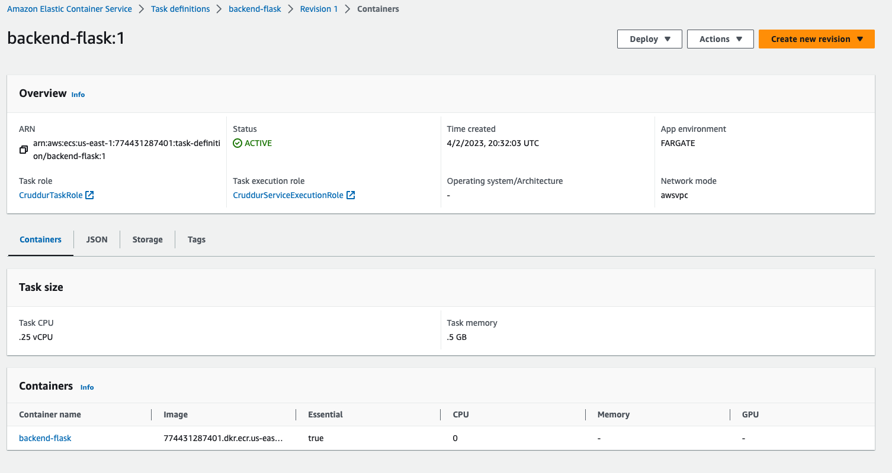
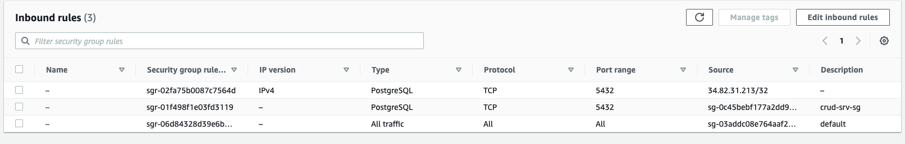
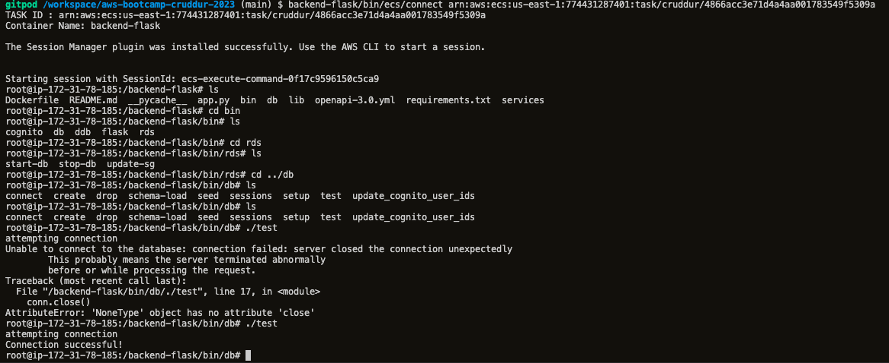
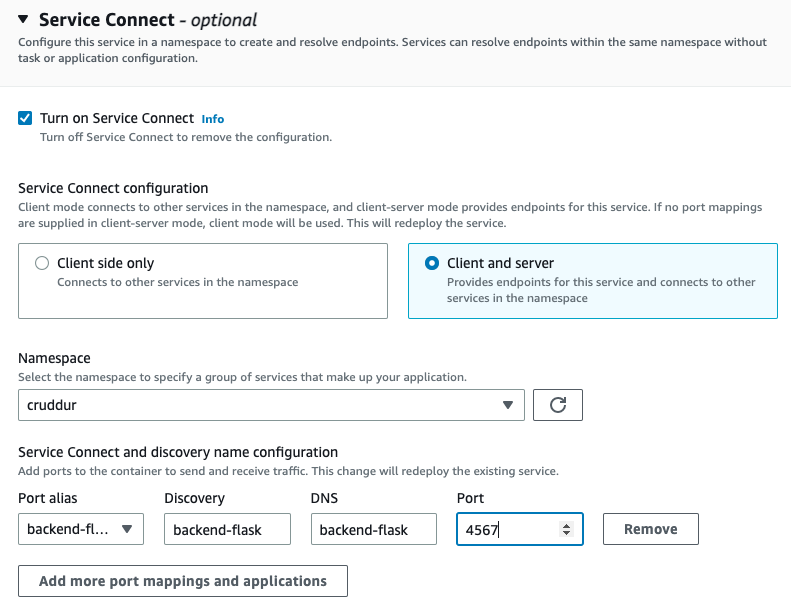
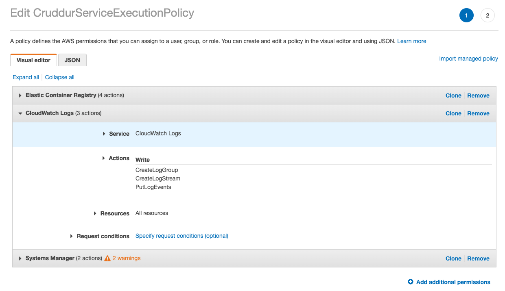

# Week 6 — Deploying Containers

- Created `bin/db/test` to perform healthcheck against rds
- Added healthcheck endpoint to `app.py`
- Added `bin/flask/health-check` to test the health check
- Created Cloudwatch group for cluster:
  ```
  aws logs create-log-group --log-group-name "cruddur"
  aws logs put-retention-policy --log-group-name "cruddur" --retention-in-days 1
  ```
- Create an ecs cluster

  ```
  aws ecs create-cluster \
    --cluster-name cruddur \
    --service-connect-defaults namespace=cruddur
  ```

- Create Elastic Container Registry (ECR):

  ```
  aws ecr create-repository \
  --repository-name cruddur-python \
  --image-tag-mutability MUTABLE
  ```

## Prepare images for ECR

### Python Base

- Log in to ECR: `aws ecr get-login-password --region $AWS_DEFAULT_REGION | docker login --username AWS --password-stdin "$AWS_ACCOUNT_ID.dkr.ecr.$AWS_DEFAULT_REGION.amazonaws.com"`
- Export the repository url: `export ECR_PYTHON_URL="$AWS_ACCOUNT_ID.dkr.ecr.$AWS_DEFAULT_REGION.amazonaws.com/cruddur-python"`
- Pull prerequisites locally: `docker pull python:3.10-slim-buster`
- Tag the prereq : `docker tag python:3.10-slim-buster $ECR_PYTHON_URL:3.10-slim-buster`
- Push it to ECR: `docker push $ECR_PYTHON_URL:3.10-slim-buster`

### Backend flask

- Create the repo: `aws ecr create-repository   --repository-name backend-flask   --image-tag-mutability MUTABLE`
- Export repo url: `export ECR_BACKEND_FLASK_URL="$AWS_ACCOUNT_ID.dkr.ecr.$AWS_DEFAULT_REGION.amazonaws.com/backend-flask"`
- Build the image `docker build -t backend-flask .`
- Tag it: `docker tag backend-flask:latest $ECR_BACKEND_FLASK_URL:latest`
- Publish / Push : `docker push $ECR_BACKEND_FLASK_URL:latest`

### Frontend react

- Create the repo: `aws ecr create-repository   --repository-name frontend-react-js   --image-tag-mutability MUTABLE`
- Export repo url: `export ECR_FRONTEND_REACT_URL="$AWS_ACCOUNT_ID.dkr.ecr.$AWS_DEFAULT_REGION.amazonaws.com/frontend-react-js"`
- Build the image
  ```
  docker build \
  --build-arg REACT_APP_BACKEND_URL="https://4567-$GITPOD_WORKSPACE_ID.$GITPOD_WORKSPACE_CLUSTER_HOST" \
  --build-arg REACT_APP_AWS_PROJECT_REGION="$AWS_DEFAULT_REGION" \
  --build-arg REACT_APP_AWS_COGNITO_REGION="$AWS_DEFAULT_REGION" \
  --build-arg REACT_APP_AWS_USER_POOLS_ID="us-east-1_Ynp7ieLpL" \
  --build-arg REACT_APP_CLIENT_ID="77b6n92j77dtiq8f6l2lm7mbb0" \
  -t frontend-react-js \
  -f Dockerfile.prod \
  .
  ```
- Tag it: `docker tag frontend-react-js:latest $ECR_FRONTEND_REACT_URL:latest`
- Publish / Push : `docker push $ECR_FRONTEND_REACT_URL:latest`

## Set up ECS

### Set up parameter store

```sh
aws ssm put-parameter --type "SecureString" --name "/cruddur/backend-flask/AWS_ACCESS_KEY_ID" --value $AWS_ACCESS_KEY_ID
aws ssm put-parameter --type "SecureString" --name "/cruddur/backend-flask/AWS_SECRET_ACCESS_KEY" --value $AWS_SECRET_ACCESS_KEY
aws ssm put-parameter --type "SecureString" --name "/cruddur/backend-flask/CONNECTION_URL" --value $PROD_CONNECTION_URL
aws ssm put-parameter --type "SecureString" --name "/cruddur/backend-flask/ROLLBAR_ACCESS_TOKEN" --value $ROLLBAR_ACCESS_TOKEN
aws ssm put-parameter --type "SecureString" --name "/cruddur/backend-flask/OTEL_EXPORTER_OTLP_HEADERS" --value "x-honeycomb-team=$HONEYCOMB_API_KEY"
```


### Create execution role

- Create `aws/policies/service-assume-role-execution-policy.json` and create IAM role: `aws iam create-role --role-name CruddurServiceExecutionRole --assume-role-policy-document file://aws/policies/service-assume-role-execution-policy.json`
- Create `aws/policies/service-execution-policy.json` and create IAM role policy: `aws iam put-role-policy   --policy-name CruddurServiceExecutionPolicy   --role-name CruddurServiceExecutionRole   --policy-document file://aws/policies/service-execution-policy.json`
  
  

### Create task role

```sh
aws iam create-role \
    --role-name CruddurTaskRole \
    --assume-role-policy-document "{
  \"Version\":\"2012-10-17\",
  \"Statement\":[{
    \"Action\":[\"sts:AssumeRole\"],
    \"Effect\":\"Allow\",
    \"Principal\":{
      \"Service\":[\"ecs-tasks.amazonaws.com\"]
    }
  }]
}"

aws iam put-role-policy \
  --policy-name SSMAccessPolicy \
  --role-name CruddurTaskRole \
  --policy-document "{
  \"Version\":\"2012-10-17\",
  \"Statement\":[{
    \"Action\":[
      \"ssmmessages:CreateControlChannel\",
      \"ssmmessages:CreateDataChannel\",
      \"ssmmessages:OpenControlChannel\",
      \"ssmmessages:OpenDataChannel\"
    ],
    \"Effect\":\"Allow\",
    \"Resource\":\"*\"
  }]
}
"

aws iam attach-role-policy --policy-arn arn:aws:iam::aws:policy/CloudWatchFullAccess --role-name CruddurTaskRole
aws iam attach-role-policy --policy-arn arn:aws:iam::aws:policy/AWSXRayDaemonWriteAccess --role-name CruddurTaskRole
```


## Set up ECS service

Create task definition `aws/task-definitions/backend-flask.json`

Register task definition `aws ecs register-task-definition --cli-input-json file://aws/task-definitions/backend-flask.json`


Grab some VPC environment variables

```sh
export DEFAULT_VPC_ID=$(aws ec2 describe-vpcs \
--filters "Name=isDefault, Values=true" \
--query "Vpcs[0].VpcId" \
--output text)
echo $DEFAULT_VPC_ID

export DEFAULT_SUBNET_IDS=$(aws ec2 describe-subnets  \
 --filters Name=vpc-id,Values=$DEFAULT_VPC_ID \
 --query 'Subnets[*].SubnetId' \
 --output json | jq -r 'join(",")')
echo $DEFAULT_SUBNET_IDS
```

Set up security group for service

```sh
export CRUD_SERVICE_SG=$(aws ec2 create-security-group \
  --group-name "crud-srv-sg" \
  --description "Security group for Cruddur services on ECS" \
  --vpc-id $DEFAULT_VPC_ID \
  --query "GroupId" --output text)
echo $CRUD_SERVICE_SG

aws ec2 authorize-security-group-ingress \
  --group-id $CRUD_SERVICE_SG \
  --protocol tcp \
  --port 4567 \
  --cidr 0.0.0.0/0

export CRUD_SERVICE_SG=$(aws ec2 describe-security-groups \
  --filters Name=group-name,Values=crud-srv-sg \
  --query 'SecurityGroups[*].GroupId' \
  --output text)
```

Create the service definition file at `aws/json/service-backend-flask.json`

Create the service: `aws ecs create-service --cli-input-json file://aws/json/service-backend-flask.json`

## Debugging containers on Fargate

Download and install the session-manager-plugin on development machine:
```
curl "https://s3.amazonaws.com/session-manager-downloads/plugin/latest/ubuntu_64bit/session-manager-plugin.deb" -o "session-manager-plugin.deb"
sudo dpkg -i session-manager-plugin.deb
```

Ensure the service definition contains a line to enable execute `"enableExecuteCommand": true`

Connect via systems manager:

```sh
aws ecs execute-command  \
--region $AWS_DEFAULT_REGION \
--cluster cruddur \
--task 219167f5c78a4c03a26d4adf130d8403 \
--container backend-flask \
--command "/bin/bash" \
--interactive
```

## Fix security group for backend-flask
Once logged into the ECS instance, we can see that the database connection is not successful (you can also see this in CloudWatch logs)

Update the default security group (which is what the RDS is using) to allow for access from the ECS instance (`crud-srv-sg`)



Validate it worked on the ECS instance command line (failure before the SG change, and success after):



## Turn on service discovery
Deleted and recreated the service through the console with service discovery turned on


Needed to update the `CruddurServiceExecutionRole` with the `logs:CreateLogGroup` permissions


Recreate it using the `service-backend-flask.json` by adding this block:
```json
"serviceConnectConfiguration": {
    "enabled": true,
    "namespace": "cruddur",
    "services": [
      {
        "portName": "backend-flask",
        "discoveryName": "backend-flask",
        "clientAliases": [{"port": 4567}]
      }
    ]
  },
  ```


## Fix platform architecture if building on Mac

The following error was caused because I'm developing on a Mac (ARM) and by default Fargate is using x86/AMD: `exec /usr/local/bin/python3: exec format error`
I updated the `aws/task-definitions/backend-flask.json` to specify the architecture as ARM and use Fargate ARM instances

```
  "runtimePlatform": {
    "operatingSystemFamily": "LINUX",
    "cpuArchitecture": "ARM64"
  },
```
