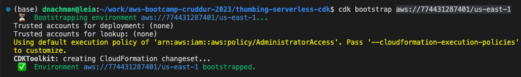
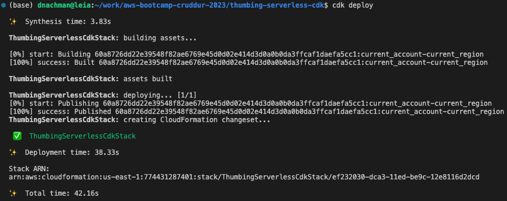
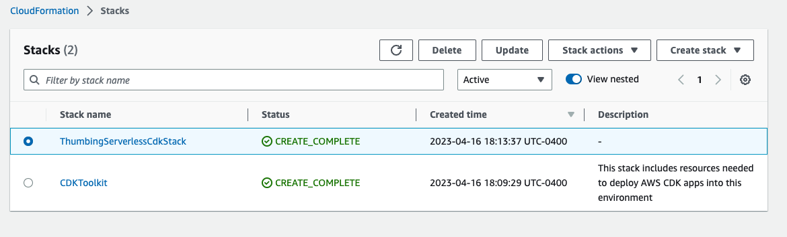
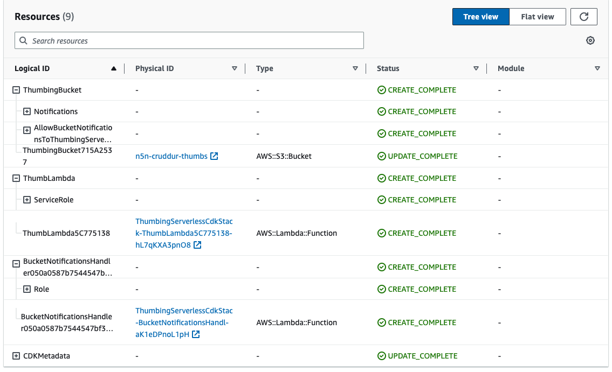
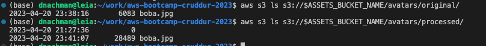
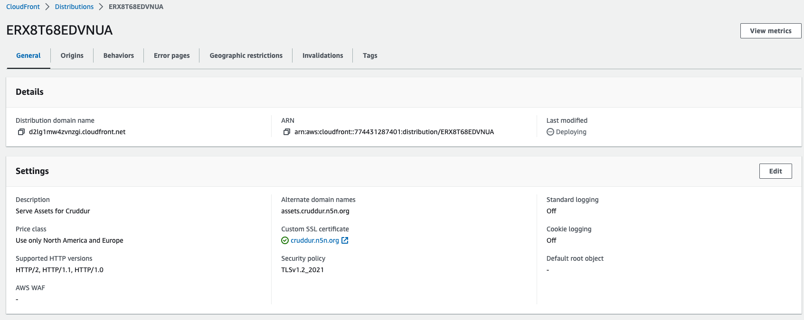
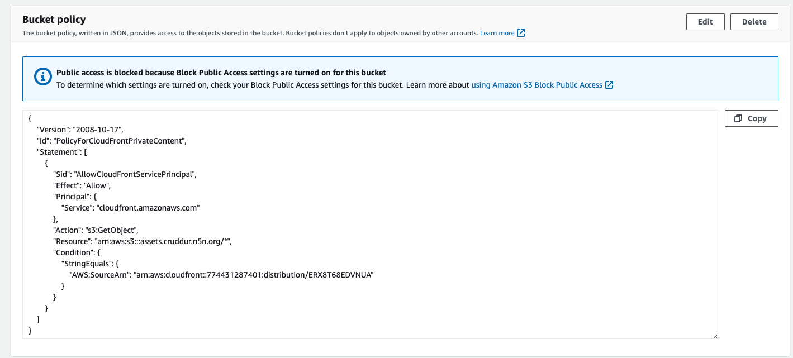
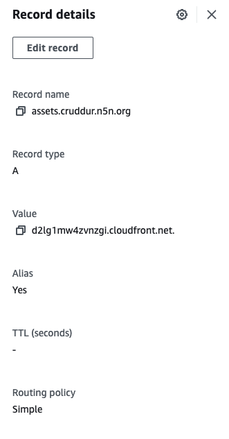

# Week 8 — Serverless Image Processing

## Setting up CDK for serverless image thumbnails

```
mkdir thumbing-serverless-cdk
cd thumbing-serverless-cdk/
cdk init app --language typescript
```

Created `thumbing-serverless-cdk-stack.ts` to set up s3 bucket

Bootstrap CDK for account/region `cdk bootstrap aws://123456789/us-east-1`


Deploy the stack with `cdk deploy`



Create the code to set up the lambda with code to be written in `aws/lambda/process-images`

Update the CDK stack to set up s3 notifications to our lambda with the package `aws-cdk-lib/aws-s3-notifications` . Our stack now:


Make sure the lambda is allowed to Read and Put against the bucket:

```
assetsBucket.grantRead(myLambda);
assetsBucket.grantPut(myLambda);
```

We can see the file processed (different sizes):


Create the SNS Topic
Create a SNS Subscription
Update / attach policies to allow permission

## CloudFront

Set up a cloudfront distribution for assets.cruddur.n5n.org:


Allow cloudfront access to the s3 bucket:


Set up Route53 so domain assets.cruddur.n5n.org is aliased to the cloudfront distribution:


Refactor buckets and CDK to separate uploads from assets for distribution from cloudfront

## Implement user profiles page

Update the backend to pull data from the database by implementing `backend-flask/db/sql/users/show.sql`
