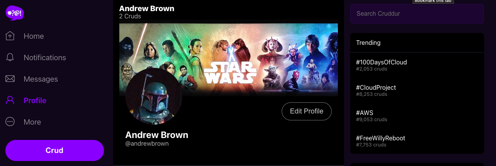

# Week 8 — Serverless Image Processing

## Setting up CDK for serverless image thumbnails

Set up the CDK locally : `npm install -g aws-cdk`

```
mkdir thumbing-serverless-cdk
cd thumbing-serverless-cdk/
cdk init app --language typescript
```

Created `thumbing-serverless-cdk-stack.ts` to set up s3 bucket

Bootstrap CDK for account/region `cdk bootstrap aws://123456789/us-east-1`


Deploy the stack with `cdk deploy`


Create the code to set up the lambda with code to be written in `aws/lambda/process-images`

Update the CDK stack to set up s3 notifications to our lambda with the package `aws-cdk-lib/aws-s3-notifications` . Our stack now:


Make sure the lambda is allowed to Read and Put against the bucket:

```
assetsBucket.grantRead(myLambda);
assetsBucket.grantPut(myLambda);
```

We can see the file processed (different sizes):


Create the SNS Topic
Create a SNS Subscription
Update / attach policies to allow permission

## CloudFront

Set up a cloudfront distribution for assets.cruddur.n5n.org:


Allow cloudfront access to the s3 bucket:


Set up Route53 so domain assets.cruddur.n5n.org is aliased to the cloudfront distribution:


Refactor buckets and CDK to separate uploads from assets for distribution from cloudfront

## Implement user profiles page

Update the backend to pull data from the database by implementing `backend-flask/db/sql/users/show.sql`
Create new components, their css and adjust some other components sucah as UserFeedPage, etc:

- ProfileForm
- ProfileHeading
- ProfileAvatar
- EditProfileButton

Here's what it is looking at while working through it so far:


## DB Migration code

Implement db migration scripts and new table `public.schema_information`


Here's the user profile page after the changes:


## Client side avatar upload

Create a lambda to return the presigned URL
**I skipped Ruby and did it in Javascript**

Create a lambda authorizer function `aws/lambda/cruddur-upload-avatar-js/index.mjs`:

```js
import { getSignedUrl } from "@aws-sdk/s3-request-presigner";
import { S3Client, PutObjectCommand } from "@aws-sdk/client-s3";
import { CognitoJwtVerifier } from "aws-jwt-verify";

export const handler = async (event, context) => {
  let response = {};

  console.log("event: " + JSON.stringify(event));
  console.log("context: " + JSON.stringify(context));

  if (event.routeKey === "OPTIONS /{proxy+}") {
    response = {
      statusCode: 200,
      body: JSON.stringify({
        step: "preflight",
        message: "preflight CORS check",
      }),
    };
    console.log("preflight CORS check:  " + JSON.stringify(response));
  } else {
    const jwtVerifier = CognitoJwtVerifier.create({
      userPoolId: process.env.USER_POOL_ID,
      tokenUse: "access",
      clientId: process.env.CLIENT_ID,
    });

    const jwt = event.headers.authorization;
    try {
      const payload = await jwtVerifier.verify(jwt);
      console.log("JWT payload:", payload);

      const putObjectParams = {
        Bucket: process.env.UPLOADS_BUCKET,
        Key:
          process.env.UPLOADS_BUCKET_PATH +
          "/" +
          payload.sub +
          "." +
          JSON.parse(event.body).extension,
      };

      console.log("putObjectParams:  " + JSON.stringify(putObjectParams));

      const client = new S3Client({ region: "us-east-1" });
      const command = new PutObjectCommand(putObjectParams);
      const url = await getSignedUrl(client, command, { expiresIn: 3600 });

      console.log("URL:  " + url);

      response = {
        statusCode: 200,
        body: JSON.stringify({ url }),
      };
    } catch (err) {
      console.error("Access forbidden:", err);
      response = {
        statusCode: 401,
        body: "Invalid JWT",
      };
      return {
        isAuthorized: false,
      };
    }
  }

  // common headers
  response.headers = {
    "Access-Control-Allow-Headers": "*, Authorization",
    "Access-Control-Allow-Origin": process.env.CORS_ALLOW_ORIGIN, // change this to reflect the origin we received (maybe check allow-list?)
    "Access-Control-Allow-Methods": "OPTIONS,GET,POST",
  };

  console.log("response: " + JSON.stringify(response));

  return response;
};
```

Set environment variables:


Connect api gateway for the GET `/avatars/key_upload` path with the authorizer

Set up CORS for the s3 upload bucket:

```
[
    {
        "AllowedHeaders": [
            "*"
        ],
        "AllowedMethods": [
            "PUT"
        ],
        "AllowedOrigins": [
            "*"
        ],
        "ExposeHeaders": [
            "x-amz-server-side-encryption",
            "x-amz-request-id",
            "x-amz-id-d"
        ],
        "MaxAgeSeconds": 30000
    }
]
```

## Create a lambda layer for the function:

Script to create the layer `bin/lambda-layers\nodejs-jwt`:

```sh
#! /usr/bin/bash

TMP_DIR="/tmp/dnachman/lambda-layers"

if [ ! -d $TMP_DIR ]; then
  mkdir -p "$TMP_DIR"
fi

cd "$TMP_DIR"

npm init -y
npm install aws-jwt-verify

zip -r aws-jwt-verify.zip .

aws lambda publish-layer-version \
  --layer-name aws-jwt-verify  \
  --description "Lambda Layer for aws-jwt-verify" \
  --license-info "MIT" \
  --zip-file fileb://aws-jwt-verify.zip \
  --compatible-runtimes nodejs18.x

rm -r "$TMP_DIR"
```

Configuring the layer:


## Serve the profile avatars

Many changes across the frontend code to show the avatars from s3

End result is here:


## Extra stuff

Posting activities (crud button) were hard coded to the Andrew Brown id. (This will probably get fixed later in the course) Fixed it by:

- Modifying `app.py` to read the **cognito_user_id** from the claims
- Modify `create_activity.py` and `create.sql` to use the Cognito user id to give credit to the poster
- `ActivityForm.js` needed to send `Authorization` header
- Modified the `DateTimeFormats.js` to not show negative numbers and clean up the display


- I also implemented the upload lambda as NodeJS instead of Ruby, as described above.
