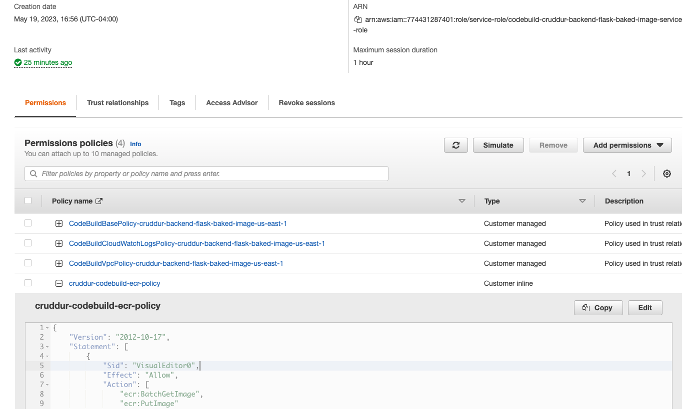
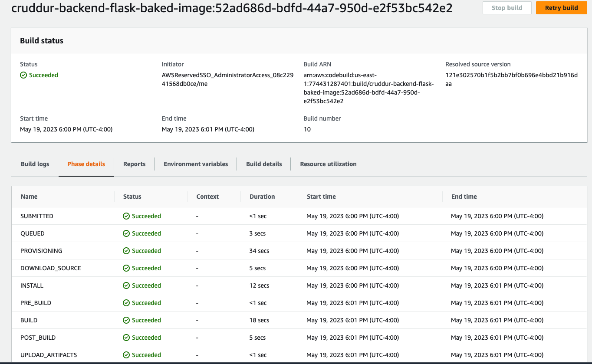
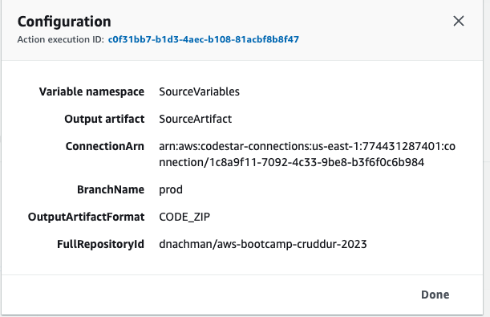
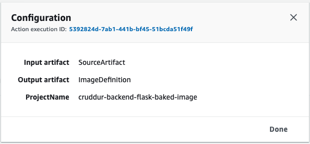
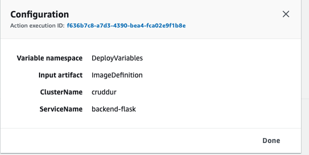
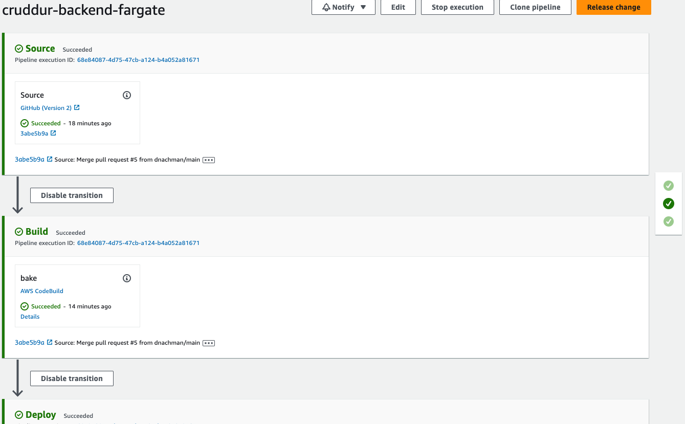

# Week 9 — CI/CD with CodePipeline, CodeBuild and CodeDeploy

## Set up code pipeline

### Create a pipeline for `cruddur-backend-fargate`

Connect github, select repository
Create a `prod` branch in github

Create a CodeBuild project `cruddur-backend-flask-baked-image`

Create a `buildspec.yml` in backend project:

```yaml
# Buildspec runs in the build stage of your pipeline.
version: 0.2
phases:
  install:
    runtime-versions:
      docker: 20
    commands:
      - echo "cd into $CODEBUILD_SRC_DIR/backend"
      - cd $CODEBUILD_SRC_DIR/backend-flask
      - aws ecr get-login-password --region $AWS_DEFAULT_REGION | docker login --username AWS --password-stdin $IMAGE_URL
  build:
    commands:
      - echo Build started on `date`
      - echo Building the Docker image...
      - docker build -t backend-flask .
      - "docker tag $REPO_NAME $IMAGE_URL/$REPO_NAME"
  post_build:
    commands:
      - echo Build completed on `date`
      - echo Pushing the Docker image..
      - docker push $IMAGE_URL/$REPO_NAME
      - cd $CODEBUILD_SRC_DIR
      - echo "imagedefinitions.json > [{\"name\":\"$CONTAINER_NAME\",\"imageUri\":\"$IMAGE_URL/$REPO_NAME\"}]" > imagedefinitions.json
      - printf "[{\"name\":\"$CONTAINER_NAME\",\"imageUri\":\"$IMAGE_URL/$REPO_NAME\"}]" > imagedefinitions.json

env:
  variables:
    AWS_ACCOUNT_ID: 220856138283
    AWS_DEFAULT_REGION: us-east-1
    CONTAINER_NAME: backend-flask
    IMAGE_URL: 220856138283.dkr.ecr.us-east-1.amazonaws.com
    REPO_NAME: backend-flask:latest
artifacts:
  files:
    - imagedefinitions.json
```

Added ecr:getAuthorizationToken permissions to the CodeBuild role:

```json
{
  "Version": "2012-10-17",
  "Statement": [
    {
      "Sid": "VisualEditor0",
      "Effect": "Allow",
      "Action": [
        "ecr:BatchGetImage",
        "ecr:BatchCheckLayerAvailability",
        "ecr:CompleteLayerUpload",
        "ecr:DescribeImages",
        "ecr:DescribeRepositories",
        "ecr:GetDownloadUrlForLayer",
        "ecr:InitiateLayerUpload",
        "ecr:PutImage",
        "ecr:UploadLayerPart"
      ],
      "Resource": "arn:aws:ecr:*:220856138283:repository/*"
    },
    {
      "Sid": "VisualEditor1",
      "Effect": "Allow",
      "Action": "ecr:GetAuthorizationToken",
      "Resource": "*"
    }
  ]
}
```





Updated the CodePipeline with a `bake` build stage so the stages are configured as:

Source:


Build:


Deploy:


Fully triggered push to prod and deployment:

